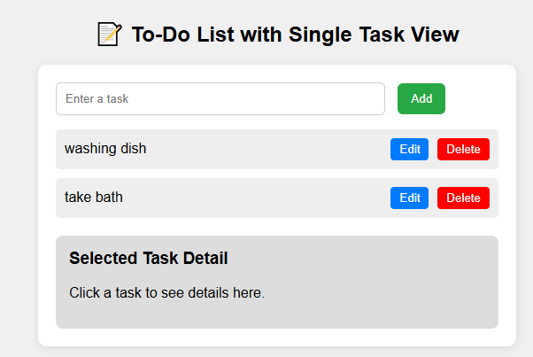

# ✅ To-Do List App

This is a simple and interactive To-Do List web application built using HTML, CSS, and JavaScript. It allows users to:

- Add tasks 📝  
- Mark tasks as complete ✅  
- Edit tasks ✏️  
- Delete tasks 🗑️  
- Save tasks in local storage 🔒  

---

## 🚀 Features

- Minimal and user-friendly UI
- Instant task management
- Persistent storage using browser's LocalStorage
- Responsive design for desktop and mobile

---

## 🛠️ Technologies Used

- HTML5  
- CSS3  
- JavaScript (ES6)

---

## 📷 Screenshot

> *(Add a screenshot of your app and name it `screenshot.png`)*

---

## 📁 Project Structure

todo-app/
├── index.html
├── style.css
├── script.js
└── README.md

## 💡 How to Use

1. Clone or download this repository.
2. Open `index.html` in your browser.
3. Start managing your tasks!

---

## 📌 Live Demo

https://athumanimfaume.github.io/todo-list/

---

## 🙌 Contributing

Pull requests are welcome! Feel free to open issues or suggest improvements.

---

## 📄 License

This project is open-source and free to use under the [MIT License](LICENSE).

---

### ✍️ Developed by [Athumani Mfaume](https://github.com/athumaniMfaume)

